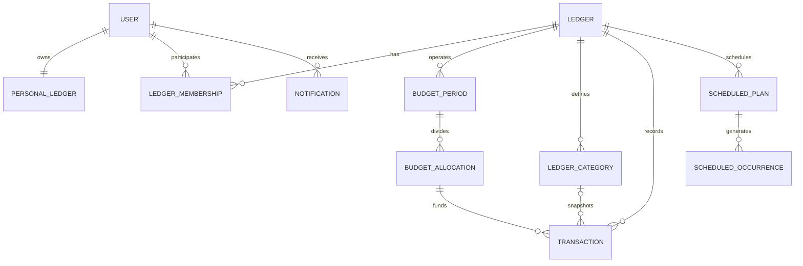

# Domain Model

이 문서는 [V1 Scope](../product/v1-scope.md)를 구현하기 위한 **목표 도메인 모델**입니다.
현재 엔티티와 테이블은 이전 제품 범위의 구현이므로 이 문서와 다를 수 있습니다. 전환 기준은 [Data Migration](./data-migration.md), 호출자 계약은 [API Contract](./api-contract.md), 세부 권한은 [Permissions](./permissions.md)를 따릅니다.

## 공통 값 규칙

- 금액은 원화 정수 `Long`으로 저장하며 음수 금액을 입력값으로 받지 않습니다. 잔액과 초과액 같은 계산 결과만 음수가 될 수 있습니다.
- 날짜는 `LocalDate`, 선택 입력인 거래 시각은 사용자 현지 시각과 UTC instant를 함께 복원할 수 있는 값으로 저장합니다.
- 사용자의 기본 시간대는 `Asia/Seoul`이며 주간 가이드와 예약 작업은 사용자 시간대를 기준으로 실행합니다.
- API 응답은 JPA entity를 직접 노출하지 않습니다.
- 과거 집계의 의미를 지켜야 하는 이름과 분류는 현재 참조가 아니라 스냅샷을 저장합니다.
- 사용자 입력 삭제가 허용된 거래는 사용자 화면과 활동 기록에서 제거합니다. 재무 집계가 남지 않도록 관련 생성 기록도 함께 처리합니다.

## 관계 개요

## 사용자와 장부

### User

- OAuth provider와 provider user id 조합으로 식별합니다.
- `nickname`, `nicknameConfirmedAt`, `timezone`, `lastUsedLedgerId`를 가집니다.
- 최초 로그인에서는 카카오 닉네임을 제안하되 서비스 닉네임을 명시적으로 확정해야 합니다.
- 기본 개인 장부는 사용자마다 정확히 하나이며 숨김·보관·삭제할 수 없습니다.
- 사용자가 접근할 수 없는 `lastUsedLedgerId`를 가리키면 기본 개인 장부로 복구합니다.

### Ledger

- `PERSONAL` 또는 `SHARED` 타입을 가집니다.
- 개인 장부는 소유자 한 명만 사용합니다. V1에서는 추가 개인 장부를 만들 수 없습니다.
- 공동 장부는 현재 활성 `OWNER` 한 명과 활성 `MEMBER` 최대 한 명을 가집니다.
- 공동 장부는 이름, 예산 기간 규칙과 예산 기본값을 가집니다.
- V1에서는 공동 장부 보관과 영구 삭제를 제공하지 않습니다.
- 한 번이라도 참여한 상대방이 있으면 그 상대방만 같은 장부에 재참여할 수 있습니다.

### Ledger Membership

- 사용자와 장부의 참여 관계이며 `OWNER`, `MEMBER` 역할을 가집니다.
- `joinedAt`, `leftAt`, `leaveReason`으로 참여 구간을 보존합니다. 재참여하면 새 참여 구간을 추가합니다.
- 공동 장부별 활성 멤버십은 최대 두 개이고 `OWNER`는 정확히 하나입니다.
- 탈퇴·내보내기 후에는 참여했던 예산 기간과 당시 공개된 데이터만 읽을 수 있습니다.
- 소유권 이전은 두 활성 멤버의 역할을 한 트랜잭션 안에서 교환합니다.
- 탈퇴 또는 내보내기는 장부의 모든 활성 예약 거래를 일시정지하고 원인을 기록합니다.

### Ledger User Preference

- 사용자와 장부별 빠른 기록 기본값을 저장합니다.
- `lastBudgetSource`, `shareNewPersonalTransactions`를 가지며 상대방 설정과 분리합니다.
- 마지막 차감 대상이 더 이상 유효하지 않으면 본인 개인 할당을 기본값으로 복구합니다.
- 전체 공유를 켤 때만 기존 개인 거래 공개 상태를 함께 변경하고, 끌 때는 이후 기본값만 변경합니다.

### Invitation

- 공동 장부의 링크 초대만 표현합니다.
- `tokenHash`, `status`, `createdBy`, `expiresAt`, `respondedBy`, `respondedAt`을 가집니다.
- 상태는 `PENDING`, `ACCEPTED`, `REJECTED`, `CANCELLED`, `REPLACED`, `EXPIRED`입니다.
- 장부마다 `PENDING` 링크는 하나뿐이며 생성 후 30분 동안 유효합니다.
- 새 링크를 만들면 기존 `PENDING` 링크를 `REPLACED`로 바꿉니다.
- 수락·거절·취소는 한 번만 성공하는 상태 전이이며 로그인 자체가 수락을 뜻하지 않습니다.

## 예산 기간과 배분

### Budget Cycle Policy

- 장부별 예산 기간 반복 규칙입니다.
- 시작 기준은 `DAY_OF_MONTH(1..28)` 또는 `LAST_DAY_OF_MONTH`입니다.
- 기간 종료일은 다음 시작일의 전날입니다.
- 시작 기준 변경은 다음 아직 시작하지 않은 기간부터 적용하고 과거 `BudgetPeriod`의 날짜를 바꾸지 않습니다.

### Budget Period

- 장부의 한 예산 운영 구간입니다.
- `startDate`, `endDate`, `totalBudget`, `preparedAt`, `sourcePeriodId`를 가집니다.
- 같은 장부의 기간은 겹치지 않으며 `(ledgerId, startDate)`가 유일합니다.
- 생성일이나 참여일이 기간 중간이어도 전체 금액을 일할 계산하지 않습니다.
- 다음 기간은 사용자가 미리 설정하거나 시작 시 직전 설정을 복사해 생성합니다.
- 이전 기간의 잔액과 초과액은 다음 기간 금액에 이월하지 않습니다.
- V1에서는 수동 마감 상태를 두지 않으며 과거 기간 거래도 권한 범위에서 수정할 수 있습니다.

### Budget Allocation

- 한 `BudgetPeriod`의 상위 예산을 나누는 단위입니다.
- 범위는 `PERSONAL` 또는 `SHARED`이며 `PERSONAL`은 대상 사용자 id를 가집니다.
- 한 기간에 활성 멤버별 개인 할당 하나와 공동 할당 하나가 존재할 수 있습니다.
- 첫 배분 전에는 allocation과 예비비가 아직 확정되지 않습니다. 배분 후 `reserve = totalBudget - personal allocations - shared allocation`으로 계산하며 별도 직접 차감 대상이 아닙니다.
- 배분 합계가 전체 예산을 초과하면 사용자가 명시적으로 전체 예산 증액을 승인한 요청에서만 저장합니다.
- 두 활성 멤버는 상위 배분 금액을 조회·변경할 수 있지만 개인 할당에서 거래를 차감하는 권한은 해당 사용자에게만 있습니다.

### Reserve Transfer

- 예비비를 본인 개인 할당 또는 공동 할당으로 옮긴 기록입니다.
- `amount`, `targetAllocationId`, `actorUserId`, `createdAt`을 가집니다.
- 원본 금액을 직접 수정하지 않고 이전 기록의 합으로 현재 배분을 설명할 수 있어야 합니다.
- 두 멤버 모두 조회하며 취소가 필요하면 반대 방향의 보정 기록을 추가합니다.

### Category Budget

- `BudgetAllocation`과 고정 대분류 조합의 세부 예산입니다.
- 공동 할당의 대분류 예산은 두 멤버가 조회·변경합니다.
- 개인 할당의 대분류 예산은 대상 사용자만 조회·변경합니다.
- 합계가 상위 할당보다 작을 수 있으며 차이는 미배분 금액입니다.
- 상위 할당보다 크게 저장하려면 같은 요청에서 상위 할당 증액을 명시적으로 승인해야 합니다.

## 카테고리

### System Category Group

- 시스템이 관리하는 변경 불가능한 대분류입니다.
- 거래 유형과 안정적인 code, 표시 이름, 정렬 순서를 가집니다.
- V1의 고정 목록과 기본 소분류는 [V1 Scope의 카테고리 구조](../product/v1-scope.md#카테고리-구조)를 원본으로 사용합니다.
- 사용자는 장부별로 대분류를 숨길 수 있지만 생성·이름 변경·삭제할 수 없습니다.

### Ledger Category

- 한 장부의 소분류입니다.
- 시스템 대분류 아래에 속하며 이름, 활성 여부, 기본 카테고리 여부를 가집니다.
- 같은 장부와 대분류 안에서 활성 이름은 중복될 수 없습니다.
- 기본 소분류도 사용자 생성 소분류와 같이 이름 변경·삭제할 수 있습니다.
- 삭제는 새 거래에서 선택할 수 없게 하는 비활성화이며 과거 거래 스냅샷은 유지합니다.

### Transaction Category Snapshot

- 거래 저장 시점의 대분류 code·이름과 소분류 id·이름을 보존합니다.
- 미분류 거래는 소분류 id와 이름이 `null`이고 대분류 집계에서 `UNCLASSIFIED`로 분리합니다.
- 소분류 이름 변경은 기본적으로 이후 거래에만 적용합니다.
- `과거 거래에도 적용` 요청은 접근 가능한 해당 장부 거래의 스냅샷을 명시적으로 일괄 변경합니다.

## 거래

### Transaction

- `EXPENSE`, `INCOME`, `TRANSFER` 유형을 가집니다.
- 금액, 사용처, 발생일, 선택 시각, 메모, 기록자, 결제자, 결제수단 정보를 가집니다.
- 공동 장부 거래는 `PERSONAL` 또는 `SHARED` scope를 가집니다. 개인 scope는 소유 사용자 id를 함께 저장합니다.
- 지출과 지출로 처리하는 이체는 `BudgetAllocation`을 반드시 참조합니다.
- 수입과 `OWN_ACCOUNTS`, `INBOUND` 이체는 예산 할당을 참조하지 않습니다.
- 예산을 차감하는 거래의 scope와 allocation 범위는 같아야 합니다.
- 이체 하위 유형은 `OWN_ACCOUNTS`, `OUTBOUND`, `INBOUND`입니다. `OUTBOUND`만 지출 집계와 예산 차감에 포함하고 `INBOUND`는 수입 집계에 포함합니다.
- 결제자와 결제수단은 설명 정보이며 차감할 예산을 결정하지 않습니다.
- 공동 할당 거래는 두 멤버가 조회·수정·삭제할 수 있습니다.
- 개인 할당 거래는 대상 사용자만 수정·삭제하고, 상대방은 공유된 거래만 읽을 수 있습니다.
- 공동 거래 수정 시 `lastModifiedBy`, `lastModifiedAt`을 갱신합니다.
- 빠른 기록은 카테고리가 필수이고 가져오기 저장은 미분류를 허용합니다.

### Transaction Visibility

- 공동 장부의 개인 scope 거래는 `sharedWithPartner`를 가지며 기본값은 기록자의 장부별 공유 기본 설정입니다.
- 공유 기본값을 켜면 기존 개인 거래를 모두 공유하고 이후 거래의 기본값도 `true`가 됩니다.
- 공유 기본값을 끌 때는 기존 거래를 바꾸지 않고 이후 기본값만 `false`로 바꿉니다.
- 거래별 공개 설정은 공유 기본값보다 우선합니다.
- 공유된 개인 거래에서도 카드 id·카드 이름 등 결제수단 식별 정보는 상대방에게 반환하지 않습니다.

### Payment Method Snapshot

- 거래에는 `CASH`, `CARD`, `OTHER` 같은 결제수단 종류와 선택적인 표시 스냅샷을 저장할 수 있습니다.
- 카드 식별 정보는 결제한 사용자 본인에게만 공개합니다.
- V1은 별도 카드 관리 화면을 범위에 포함하지 않으므로 거래 계약이 카드 원장 관리에 의존하지 않게 합니다.

### Installment Plan

- 최초 지출에서 전체 원금, 회차 수, 월 이자, 첫 결제일과 차감 할당을 저장합니다.
- 원금은 회차 수로 나누고 나머지 1원은 앞 회차부터 배분합니다.
- 각 회차는 원금과 월 이자를 합친 거래로 예정일에 생성합니다.
- 생성 거래는 plan id, 현재 회차와 전체 회차를 스냅샷으로 가집니다.
- 계획을 중단해도 이미 생성된 거래는 유지합니다.

## 예약 거래

### Scheduled Plan

- 반복 지출과 할부 회차의 공통 예약 원본입니다.
- 종류는 `RECURRING_EXPENSE`, `INSTALLMENT`입니다. V1에서는 반복 수입을 만들 수 없습니다.
- 반복 주기는 `WEEKLY`, `MONTHLY`, `YEARLY`를 지원합니다.
- `startDate`, `nextDueDate`, 선택적인 `endDate`, `status`, `pauseReason`을 가집니다.
- 반복 지출은 `isFixedExpense`로 고정비 표시 여부를 구분합니다.
- 존재하지 않는 월 일자는 해당 월 말일로 보정합니다.
- 수정은 이미 생성된 거래 한 건만 바꾸는 경우와 이후 예정분까지 바꾸는 경우를 구분합니다.
- 탈퇴·내보내기 시 `MEMBERSHIP_CHANGED` 사유로 일시정지하며 남은 사용자가 재개할 수 있습니다.

### Scheduled Occurrence

- 예약 계획의 특정 예정일과 생성된 거래를 연결합니다.
- `(planId, dueDate, sequence)`가 유일하며 스케줄러 재실행에도 중복 거래를 만들지 않습니다.
- 상태는 `SCHEDULED`, `GENERATED`, `SKIPPED`, `CANCELLED`입니다.
- 현재 기간의 미생성 `SCHEDULED` 지출만 사용 가능액에서 예정액으로 차감합니다.
- `GENERATED`가 되면 실제 거래 금액만 집계해 예정액과 중복 차감하지 않습니다.

## 거래 가져오기

### Import Session

- 한 사용자가 한 장부에 업로드한 여러 이미지의 검토 세션입니다.
- 원본 종류는 `RECEIPT` 또는 `CARD_APP_SCREENSHOT`이며 원본 이미지는 영구 거래 데이터와 분리합니다.
- 상태는 `PREVIEWED`, `SAVED`, `EXPIRED`이고 저장 요청은 한 번만 성공합니다.
- 제외된 인식 결과는 내용 없이 개수와 사유 집계만 노출합니다.

### Import Candidate

- 날짜, 금액, 사용처를 신뢰할 수 있게 인식한 임시 후보입니다.
- 추천 카테고리, 차감 할당, 중복 의심 여부·근거, 선택 기본값을 가집니다.
- 공동 장부 후보의 기본 차감 대상은 업로드한 사용자의 개인 할당입니다.
- 중복 후보는 자동 삭제하지 않고 기본 선택만 해제합니다.
- 카테고리 추천 이력은 사용자와 장부를 함께 범위로 사용합니다.
- 선택 저장 시 일반 거래 생성 권한과 validation을 다시 적용합니다.

## 조회와 알림

### Dashboard Projection

- 현재 또는 선택한 `BudgetPeriod`의 공동 할당과 로그인 사용자의 개인 할당만 홈에 표시합니다.
- 현재 잔액은 `budget - generated expenses`, 사용 가능액은 `current balance - remaining scheduled expenses`입니다.
- 상대방 개인 거래는 공유 여부와 관계없이 최근 거래와 분석에서 제외합니다.
- 상세 조회에서 상대방 할당의 합계는 볼 수 있지만 개별 거래는 공개된 거래만 반환합니다.

### Notification

- 사용자별 앱 내부 알림과 읽음 상태를 저장합니다.
- 알림은 관련 장부와 선택적인 예산 기간·거래·설정 화면의 이동 대상을 가집니다.
- 예산 임계값, 예산 변경, 예비비 이전, 다음 기간 준비, 멤버 내보내기, 예약 거래 일시정지와 주간 가이드를 구분합니다.
- 예산 기간에 속한 알림은 해당 장부의 다음 기간이 시작될 때 사용자 목록에서 제거합니다.

### Budget Threshold State

- 예산 또는 대분류 예산별 현재 알림 단계 `BELOW_80`, `AT_LEAST_80`, `AT_LEAST_100`을 저장합니다.
- 한 변경으로 두 단계를 넘으면 가장 높은 단계만 알립니다.
- 같은 단계에서는 반복 알리지 않고, 아래 단계로 내려간 뒤 재진입하면 다시 알립니다.
- 과거 기간 변경은 상태와 집계를 갱신하되 새 알림을 만들지 않습니다.

### Notification Preference

- 사용자별 `budgetWarning80Enabled`, `weeklyGuideEnabled`를 저장합니다.
- 100%·초과, 공동 예산 변경 같은 필수 알림은 끌 수 없습니다.

### Weekly Budget Guide

- 사용자, 장부, 생성 주와 예산 기간별 권장액 스냅샷입니다.
- 공동 할당과 본인 개인 할당만 계산하며 상대방 개인 할당은 포함하지 않습니다.
- 같은 사용자·장부·주에 중복 생성하지 않습니다.
- 계산식과 시간 규칙은 [Scheduled Transactions](./scheduled-transactions.md)를 따릅니다.

## 핵심 불변식

- 사용자마다 기본 개인 장부는 정확히 하나입니다.
- 공동 장부의 활성 멤버는 최대 두 명이고 `OWNER`는 정확히 한 명입니다.
- 장부의 예산 기간은 겹치지 않으며 과거 기간 경계는 정책 변경으로 움직이지 않습니다.
- 예비비는 직접 거래 차감 대상이 아닙니다.
- 사용자는 본인 개인 할당과 공동 할당에만 거래를 기록할 수 있습니다.
- 상대방 비공개 개인 거래는 금액 합계 API를 제외한 거래 상세·최근 거래·분석·검색 결과에 노출하지 않습니다. 상대방 할당 합계는 V1 Scope가 허용한 상세 화면에서만 제공합니다.
- 카테고리 변경·삭제는 과거 거래 스냅샷을 자동 변경하지 않습니다.
- 예약 occurrence의 유일성으로 자동 거래 중복 생성을 막습니다.
- 과거 기간 거래 변경은 해당 기간 집계만 다시 계산하며 새 예산 알림을 만들지 않습니다.
- 결제수단 식별 정보는 공유된 개인 거래에서도 결제한 사용자 외에는 공개하지 않습니다.
